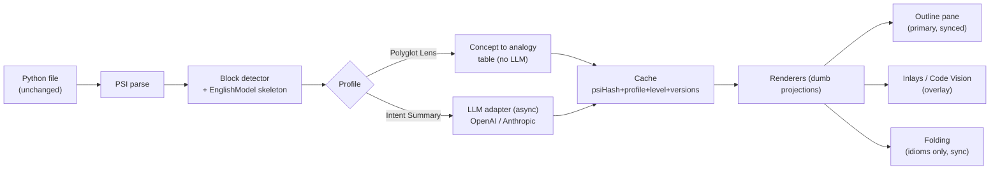
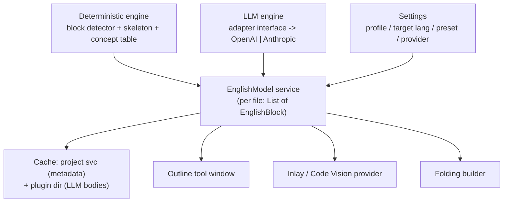

# feat: PyGloss — English-over-Python reader plugin for PyCharm

## Summary

A PyCharm/IntelliJ plugin that renders "englishish" text over Python source **without modifying the file**, to help developers *read* Python faster. Two reader profiles run over one engine: a **Polyglot Lens** (deterministic concept→analogy callouts for JS/Java/Go/C# devs — no LLM) and an **Intent Summary** profile (LLM block/function summaries over a deterministic PSI skeleton). One generated `EnglishModel` per file feeds three dumb render surfaces: a synced **outline tool-window** (primary), **block inlays / Code Vision** (overlay), and **folding** (tiny idioms only). Verbosity is chosen via four named presets (Code / Hints / Outline / Reader). The LLM path is provider-agnostic — settings take Provider (OpenAI-compatible | Anthropic) + Base URL + Model + API key — and the Polyglot Lens works zero-config.

No phased MVP: all of the above ships in the first release. Target baseline **2025.3+** (Kotlin, IntelliJ Platform Gradle plugin 2.x).

---

## Problem Frame

PyCharm's users are developers — there are no non-programmers in the IDE, so "plain English for accountants" targets a user who isn't there (see origin: `docs/research.html`). The real reading needs are all dev-shaped: a JS/Java/Go dev reading unfamiliar Python idioms, someone onboarding to a legacy repo, a reviewer scanning fast, a learner. The existing Java precedent (*Advanced Java Folding*) collapses verbose syntax in-editor via code folding; Python is already terse, so pure syntax-folding adds little — the value is *intent and idiom translation*, block-level, layered over an editor that stays authoritative. Google's *Natural Language Outlines* research and two rounds of adversarial review (codex CLI) both push the same shape: block-level outline, not per-line replacement; deterministic skeleton first, LLM polish second.

---

## Requirements

Traced from `docs/research.html`. Each Implementation Unit cites the R-IDs it advances.

- **R1** — Render English over Python with the file **unchanged on disk**; expandable back to real code. (folding / inlay / pane are view-only)
- **R2** — Editor stays the source of truth; English is a linked, disposable *layer*, not a replacement editor.
- **R3** — Partition code into semantically-coherent **blocks**, one intent-carrying statement each. Not per-line.
- **R4** — **Polyglot Lens**: deterministic concept→analogy for target langs JS/Java/Go/C#, covering `async`/`await`, `with`, comprehensions, decorators, `self`, `*args`/`**kwargs`, `yield`/generators, GIL-relevant threading, dunder methods, `:=`. Labeled "Closest analogy," with confidence tier + lossy caveat. No LLM.
- **R5** — **Intent Summary**: LLM block/function summaries built on the deterministic PSI skeleton; stale badge + regenerate.
- **R6** — Three render surfaces fed by **one** `EnglishModel`: outline pane (primary), block inlays / Code Vision (overlay), folding (tiny idioms only).
- **R7** — Verbosity **presets**: Code / Hints / Outline / Reader (adjust granularity + prose detail + which surfaces are active). No continuous slider.
- **R8** — Provider settings for the LLM path: Provider (OpenAI-compatible | Anthropic), Base URL, Model name (free text), API key (in PasswordSafe). Polyglot Lens needs no provider (zero-config).
- **R9** — Cache keyed by `{normalizedPsiHash, profile, level, promptVersion, pluginVersion}`; invalidate on PSI change; never persist generated text into source/VCS.
- **R10** — All features present in the first release (no phased MVP).
- **R11** — Target **2025.3+**; depend on `PythonCore` (+ `Pythonid` only if a Pro-only API is needed); work in PyCharm Community + Professional.
- **R12** — **Excluded by design** (scope/safety, not phasing): per-line replacement, bidirectional sync (edit English → rewrite Python), full custom editor, LSP, continuous verbosity slider, and the word "Equivalent."
- **NFR1** — Off-EDT for all network/IO/PasswordSafe; folding stays synchronous and cheap.
- **NFR2** — Bounded cost on large files: operate on the open/visible file, cap block count, cancel aggressively.

---

## Key Technical Decisions

- **KTD1 — One shared `EnglishModel`; renderers are dumb projections.** A per-file model of blocks → `{skeleton, concepts, analogy?, summary?, renderPolicy}`. The pane renders the full tree, inlays render selected block text, folding renders tiny idiom labels — none generate their own English. *Rationale:* three separate generators would triple cost, drift, and cache logic. *(codex-confirmed.)*
- **KTD2 — Deterministic skeleton first, LLM polishes second.** Block structure + rough gloss come from PSI (offline, cacheable, zero hallucination); the LLM only refines/summarizes. *Rationale:* caps hallucination and cost; keeps the plugin useful with no provider.
- **KTD3 — Polyglot Lens is a static data table, not an LLM.** Concept→analogy is a curated lookup keyed by PSI node/pattern. *Rationale:* deterministic, sparse (concept-triggered), low-risk, zero-config — the more defensible half of the product (see origin: `docs/research.html`).
- **KTD4 — Two provider adapters behind one interface; non-streaming first.** OpenAI-compatible (`POST {base}/chat/completions`, `Authorization: Bearer`, reply at `choices[0].message.content`) covers Ollama/gpt-oss local, OpenAI, Groq, Together, OpenRouter, LM Studio, vLLM. Anthropic (`POST {base}/v1/messages`, `x-api-key` + `anthropic-version`, system separate, `max_tokens` required, reply at `content[0].text`). *Rationale:* one setting, any current/future model; local providers vary on streaming/error shape, so ship non-streaming first.
- **KTD5 — Semantic PSI-hash cache; two stores; never in VCS.** Normalize the hash from *structure*, not raw text — include node kind, names, signatures, decorators, parameter shape, import aliases used, operator/control-flow shape, child-block kinds, concept markers; exclude comments, whitespace, formatting, and literal *values*. Persist model metadata in a project-level service; persist bulky LLM responses in the plugin system dir keyed by hash. Invalidate via PSI/document listener + `PsiModificationTracker` with debounce; recompute deterministic model cheaply, re-request LLM only for changed block hashes. *(codex-confirmed.)*
- **KTD6 — Threading.** Folding is synchronous and cheap — it may read only already-warm in-memory labels; never cache IO / PasswordSafe / HTTP / heavy PSI walks there. The LLM path takes a background read-action snapshot (skeleton DTO + `SmartPsiElementPointer` + ranges + hashes), does network *outside* the read action, then updates the cache and triggers `DaemonCodeAnalyzer.restart` / inlay refresh. Batch updates per file/model-version to avoid inlay flicker.
- **KTD7 — Target 2025.3+ (user decision).** Unlocks async PasswordSafe (no EDT-blocking key reads) and current inlay/Code Vision APIs. Accepts a smaller-but-recent install base.
- **KTD8 — Code Vision behind an adapter with a declarative/block-inlay fallback.** The Code Vision API is experimental; isolate it so the overlay can degrade to declarative/block inlays.
- **KTD9 — "Closest analogy" wording, never "Equivalent."** Every polyglot mapping carries a confidence tier and a one-line lossy caveat (e.g. Python `async def` ≠ JS `async function` — different concurrency model). *Rationale:* honest, sparse callouts read as trustworthy; overclaimed equivalence reads as a liar.
- **KTD10 — Kotlin + IntelliJ Platform Gradle plugin 2.x**, `bundledPlugin("PythonCore")`, `plugin.xml` depends on `com.intellij.modules.python`.

---

## High-Level Technical Design

Pipeline — file → deterministic model → profile-specific enrichment → cache → three surfaces:



Component ownership — one model, many consumers:



`EnglishBlock` shape (directional, not a spec): `stableId`, `kind` (module/class/function/loop/with/try/comprehension/…), `textRange`, `anchorOffset`, `skeleton` (deterministic facts), `concepts` (async/with/yield/self/…), `analogy?` (Polyglot Lens), `summary?` (Intent Summary), `renderPolicy` (pane/inlay/fold eligibility by verbosity preset).

---

## Output Structure

Greenfield layout (per-unit `**Files:**` remain authoritative; implementer may adjust):

```
PyGloss/
├── build.gradle.kts
├── settings.gradle.kts
├── gradle.properties                      # platformVersion=2025.3, pythonPlugin=PythonCore
├── src/main/kotlin/dev/pygloss/
│   ├── model/                             # EnglishModel, EnglishBlock, BlockKind, Concept
│   ├── engine/
│   │   ├── BlockDetector.kt               # PSI walk -> blocks + skeleton + hash
│   │   ├── PsiHash.kt                     # normalized semantic hash
│   │   ├── ConceptTable.kt                # concept -> per-lang analogy data
│   │   └── EnglishModelService.kt         # per-file model build + cache orchestration
│   ├── cache/                             # ModelCacheService (project) + disk store
│   ├── llm/
│   │   ├── LlmAdapter.kt                  # interface
│   │   ├── OpenAiCompatAdapter.kt
│   │   ├── AnthropicAdapter.kt
│   │   └── IntentSummaryPipeline.kt
│   ├── render/
│   │   ├── PyGlossFoldingBuilder.kt
│   │   ├── PyGlossInlayProvider.kt      # + CodeVision adapter w/ fallback
│   │   └── OutlineToolWindow.kt           # + factory, tree/table, caret sync
│   ├── settings/                          # Settings state, PasswordSafe, config UI
│   └── PyGlossBundle.kt / actions/      # toggle actions, presets, gutter icons
├── src/main/resources/META-INF/
│   ├── plugin.xml
│   └── python-features.xml                # optional-dep feature file
└── src/test/
    ├── kotlin/dev/pygloss/…           # unit + BasePlatformTestCase tests
    └── testData/                          # Python fixture files
```

---

## Scope Boundaries

### Permanently excluded (safety/scope, not phasing)
- **Per-line replacement** — noise; use block-level outlines (R3).
- **Bidirectional sync** (edit English → LLM rewrites Python) — silent code rewrites from prose are dangerous. If ever wanted, must be explicit: propose patch → diff → approval → run tests. Out of scope by design.
- **Full custom editor / LSP** — fights the platform; this is a PSI projection problem.
- **Continuous verbosity slider** — named presets instead (R7).
- **The word "Equivalent"** — "Closest analogy" with caveats (KTD9).

### Deferred to Follow-Up Work
- **Streaming LLM responses** — ship non-streaming first (KTD4); add streaming once adapters are stable.
- **Additional target languages** beyond JS/Java/Go/C# (e.g. Ruby, Rust) — table is extensible.
- **Export / share outline artifact** — mentioned in origin; useful but not load-bearing for the reading experience.
- **Community-contributed concept-table entries** (external data file + contribution flow).

---

## Implementation Units

### U1. Plugin skeleton + PyCharm wiring
- **Goal:** A buildable, installable, empty plugin that loads in PyCharm 2025.3+ with Python PSI on the classpath and a settings shell.
- **Requirements:** R10, R11.
- **Dependencies:** none.
- **Files:** `build.gradle.kts`, `settings.gradle.kts`, `gradle.properties`, `src/main/resources/META-INF/plugin.xml`, `src/main/resources/META-INF/python-features.xml`, `src/main/kotlin/dev/pygloss/PyGlossBundle.kt`, `src/test/kotlin/dev/pygloss/PluginLoadsTest.kt`.
- **Approach:** IntelliJ Platform Gradle plugin 2.x; `platformVersion=2025.3`; `bundledPlugin("PythonCore")`; `plugin.xml` `<depends>com.intellij.modules.python</depends>` + optional-dep `python-features.xml`. Kotlin. Register nothing functional yet beyond an empty settings configurable so wiring is proven.
- **Patterns to follow:** IntelliJ SDK plugin template; `bundledPlugin()` per JetBrains PyCharm plugin docs.
- **Test scenarios:** Plugin descriptor is valid and the sandbox IDE starts with the plugin enabled (verifier/`runIde` smoke). `Test expectation: none for business logic` — this unit is scaffolding; the value check is that `verifyPlugin` passes and Python PSI classes resolve at compile time.
- **Verification:** `runIde` launches PyCharm with the plugin listed and enabled; `verifyPlugin` clean against 2025.3.

### U2. PSI block detector + `EnglishModel`
- **Goal:** Walk a `PyFile` and produce the deterministic per-file `EnglishModel`: ordered blocks with stable IDs, kind, ranges, skeleton facts, concept markers, and normalized hash.
- **Requirements:** R3, R6 (model), R9 (hash), NFR2.
- **Dependencies:** U1.
- **Files:** `src/main/kotlin/dev/pygloss/model/EnglishModel.kt`, `.../model/EnglishBlock.kt`, `.../model/BlockKind.kt`, `.../model/Concept.kt`, `.../engine/BlockDetector.kt`, `.../engine/PsiHash.kt`, `src/test/kotlin/dev/pygloss/engine/BlockDetectorTest.kt`, `.../engine/PsiHashTest.kt`, `src/test/testData/*.py`.
- **Approach:** Detect `PyFunction`, `PyClass`, control blocks (`PyIfStatement`, `PyForStatement`, `PyWhileStatement`, `PyWithStatement`, `PyTryExceptStatement`), and `PyComprehensionElement`. Assign stable IDs from a structural path (not offsets). Skeleton = deterministic facts (name, params, return-ish, control shape). Concept markers detect `async`/`with`/`yield`/`self`/`*args`/`**kwargs`/decorator/`:=`/dunder. `PsiHash` normalizes per KTD5 (structure + signatures + concept markers + import aliases used; exclude comments/whitespace/literal values). Cap block count for very large files.
- **Patterns to follow:** `com.jetbrains.python.psi` visitor patterns; `BasePlatformTestCase` fixtures.
- **Test scenarios:**
  - Covers R3. A file with a class containing two methods, a module-level `for` loop, and a comprehension produces exactly the expected block tree (kinds + nesting + order).
  - Stable IDs: reformatting the fixture (whitespace/comments only) yields identical block IDs and identical `PsiHash` per block.
  - Semantic change: renaming a parameter or adding a branch changes that block's `PsiHash` but not sibling blocks'.
  - Concept detection: `async def`, `with`, `yield`, `[x for x in xs if p]`, `@decorator`, `self`, `*args`, `:=`, `__len__` each set the correct concept marker; a plain function sets none.
  - Edge: empty file → empty model; syntactically incomplete file (mid-edit PSI errors) → partial model, no exception.
  - NFR2: a synthetic 5k-line file stays under the block cap and detection completes within a set time budget (assert cap honored).
- **Verification:** Block tree, IDs, and hashes match fixtures; whitespace/comment edits are hash-stable; semantic edits bust only the changed block.

### U3. Deterministic concept table + folding (proves end-to-end)
- **Goal:** The Polyglot Lens data table + a synchronous folding builder that collapses tiny idioms to a short gloss — first in-editor proof that PSI → model → render works, with no provider/LLM/async.
- **Requirements:** R1, R4, R6 (folding), R7 (Code/Hints coupling), R12 (wording), NFR1.
- **Dependencies:** U2.
- **Files:** `src/main/kotlin/dev/pygloss/engine/ConceptTable.kt`, `.../render/PyGlossFoldingBuilder.kt`, `src/main/resources/META-INF/plugin.xml` (register `com.intellij.lang.foldingBuilder`), `src/test/kotlin/dev/pygloss/engine/ConceptTableTest.kt`, `.../render/FoldingBuilderTest.kt`, `src/test/testData/folding/*.py`.
- **Approach:** `ConceptTable` maps each `Concept` → per-target-language `{closestAnalogy, confidenceTier, caveat}` for JS/Java/Go/C#. Folding builds `FoldingDescriptor`s only for tiny deterministic idioms (comprehensions, boolean expressions, obvious `if`/`return`); `getPlaceholderText()` returns the deterministic gloss; `isCollapsedByDefault()` follows the active preset. `DumbAware`. No async, no cache dependency yet (read model directly). Wording uses "Closest analogy," never "Equivalent."
- **Patterns to follow:** `FoldingBuilderEx` + `com.intellij.lang.foldingBuilder`; *Advanced Java Folding* as the mechanism precedent.
- **Test scenarios:**
  - Covers R4. Every `Concept` has a non-empty analogy + confidence + caveat for all four target languages (data completeness test).
  - Covers R12. No table entry contains the word "Equivalent"; each carries a caveat string.
  - Covers R1. Folding a comprehension yields the expected placeholder text and the document text is unchanged (file bytes identical before/after fold).
  - Folding fires only for whitelisted idioms — a plain multi-statement function body produces no fold region.
  - Preset coupling: under `Code` preset no English placeholders show; under `Hints`+ the idiom folds render.
  - Edge: nested comprehension folds at the outer element only (no overlapping regions).
- **Verification:** Idioms fold to English glosses in `runIde`; file on disk unchanged; expand restores real Python; table passes completeness + no-"Equivalent" checks.

### U4. Model cache + invalidation
- **Goal:** A project-level cache service that memoizes `EnglishModel`s by normalized hash, persists bulky LLM bodies to the plugin dir, invalidates on PSI change, and exposes stale/regenerate state.
- **Requirements:** R9, NFR1, NFR2.
- **Dependencies:** U2 (hash), U3 (deterministic model to cache).
- **Files:** `src/main/kotlin/dev/pygloss/cache/ModelCacheService.kt`, `.../cache/DiskStore.kt`, `.../engine/EnglishModelService.kt`, `src/test/kotlin/dev/pygloss/cache/ModelCacheServiceTest.kt`, `.../cache/CacheKeyTest.kt`.
- **Approach:** Cache key = `{normalizedPsiHash, profile, level, promptVersion, pluginVersion}`. Metadata + deterministic model in a project service (in-memory + light persistence); LLM response bodies in the plugin system dir keyed by hash (never in project/VCS). Invalidate via PSI/document listener + `PsiModificationTracker`, debounced; recompute deterministic model cheaply, drop only changed block hashes for LLM. Request coalescing + size cap/eviction. Expose `isStale(block)` for the stale badge.
- **Patterns to follow:** `@Service(PROJECT)`, `PsiModificationTracker`, `PsiTreeChangeListener`; plugin system-dir path via `PathManager`.
- **Test scenarios:**
  - Covers R9. Same file + same key → second lookup is a cache hit (no recompute).
  - Whitespace/comment edit → key stable → cache still hits.
  - Semantic edit to one block → that block's entry busts, siblings retained.
  - `promptVersion` or `pluginVersion` bump → all LLM entries invalidated, deterministic entries retained.
  - Eviction: exceeding the size cap evicts least-recently-used entries; deterministic model always rebuildable.
  - Persistence: LLM body round-trips through the disk store; nothing is written under the project/VCS root.
  - `isStale` flips true after a semantic edit until regenerate runs.
- **Verification:** Cache hit/miss behavior matches key semantics; no writes under project root; stale flag drives the badge; invalidation is debounced (no thrash on rapid typing).

### U5. Outline tool window (primary surface)
- **Goal:** The primary reader surface — a synced tool window showing the block/function outline from `EnglishModel`, with profile / target-language / preset selectors and two-way caret↔outline sync.
- **Requirements:** R2, R6 (pane), R7, R8 (selectors), R4/R5 (profile display).
- **Dependencies:** U2, U4 (model + cache), U3 (deterministic content), U7 (profile/lang/provider settings source).
- **Files:** `src/main/kotlin/dev/pygloss/render/OutlineToolWindow.kt`, `.../render/OutlineToolWindowFactory.kt`, `.../actions/PresetActions.kt`, `src/main/resources/META-INF/plugin.xml` (register `toolWindow`), `src/test/kotlin/dev/pygloss/render/OutlineModelTest.kt`.
- **Approach:** Tree/table built from the model; click outline node → select code range; caret move → highlight the containing block. Toolbar: profile (Polyglot / Intent Summary), target language (JS/Java/Go/C#), verbosity preset. Renders analogy callouts with confidence tier + caveat; renders LLM summaries with a stale badge + regenerate action. Pure projection — no generation here.
- **Patterns to follow:** `ToolWindowFactory`, `CaretListener`, `Tree`/`JBTable`; navigate via `OpenFileDescriptor`.
- **Test scenarios:**
  - Covers R6. The outline model derived from a fixture file matches the expected node list + ranges (headless model test; UI rendering itself is manual).
  - Caret→block resolution: a caret offset inside a nested method resolves to the correct block ID.
  - Preset switch changes which nodes/detail are shown (renderPolicy honored).
  - Profile switch flips analogy vs summary content for the same block.
  - `Test expectation:` tree painting, selection highlight visuals, and toolbar ergonomics are manual (see U8 QA harness).
- **Verification:** Selecting an outline entry navigates to the code; caret in code highlights the matching entry; selectors change content live; summaries show stale badge + regenerate.

### U6. Inlays / Code Vision overlay
- **Goal:** In-editor overlay surface — one prose line per meaningful block (Code Vision) + concept callouts (declarative inlays), fed by the same model, async-safe, flicker-free.
- **Requirements:** R6 (overlay), R1 (view-only), R4/R5, R7, NFR1.
- **Dependencies:** U2, U4; U3 (deterministic content); U8 for LLM-backed summaries (inlays render whatever the model has, "…" until resolved).
- **Files:** `src/main/kotlin/dev/pygloss/render/PyGlossInlayProvider.kt`, `.../render/CodeVisionAdapter.kt`, `src/main/resources/META-INF/plugin.xml` (register inlay / code-vision providers), `src/test/kotlin/dev/pygloss/render/InlayProviderTest.kt`.
- **Approach:** `DeclarativeInlayHintsProvider` for inline concept callouts; block-level summaries via a `CodeVisionAdapter` wrapping `DaemonBoundCodeVisionProvider`, with a declarative/block-inlay fallback (KTD8, experimental API). Read from the model/cache only — never generate. Show "…" placeholder for pending LLM summaries; batch refresh per file/model-version to avoid flicker (KTD6). Respect preset (surfaces off under `Code`).
- **Patterns to follow:** `DeclarativeInlayHintsProvider`, `DaemonBoundCodeVisionProvider`, `InlayHintsProviderTestCase`.
- **Test scenarios:**
  - Covers R6. For a fixture file, the provider emits inlays at the expected offsets with the expected text (via `InlayHintsProviderTestCase`).
  - Covers R1. Inlays add annotations without altering document text (byte-identical).
  - Concept callout: an `async def` line gets the target-language analogy inlay; a plain line gets none.
  - Pending state: when the model has no summary yet, a "…" placeholder renders; when the cache fills, the next refresh shows the summary.
  - Preset: under `Code`, no inlays; under `Hints`+, inlays present.
  - `Test expectation:` visual flicker/placement quality is manual (U8).
- **Verification:** Inlays/Code Vision render from the model, update in one batch when LLM results land, never modify the file, and honor the preset; Code Vision degrades to the fallback if the experimental API is unavailable.

### U7. Provider settings + LLM adapters
- **Goal:** Settings UI + secure key storage + the two LLM adapters behind one interface, with robust error/timeout handling. No summaries wired yet (that's U8) — this unit delivers configuration + a callable client.
- **Requirements:** R8, R11, NFR1.
- **Dependencies:** U1.
- **Files:** `src/main/kotlin/dev/pygloss/settings/PyGlossSettings.kt`, `.../settings/PyGlossConfigurable.kt`, `.../settings/SecretStore.kt`, `.../llm/LlmAdapter.kt`, `.../llm/OpenAiCompatAdapter.kt`, `.../llm/AnthropicAdapter.kt`, `src/main/resources/META-INF/plugin.xml` (register `applicationConfigurable`), `src/test/kotlin/dev/pygloss/llm/OpenAiCompatAdapterTest.kt`, `.../llm/AnthropicAdapterTest.kt`, `.../settings/SettingsSerializationTest.kt`.
- **Approach:** Settings hold Provider (OpenAI-compatible | Anthropic), Base URL, Model name (free text), and non-secret prefs; the API key goes through `SecretStore` over PasswordSafe (async API, 2025.3+, off-EDT). Defaults: OpenAI-compatible → `http://localhost:11434/v1` → `gpt-oss:20b` so a local Ollama user needs no config. `LlmAdapter.summarize(request): Result` interface; `OpenAiCompatAdapter` and `AnthropicAdapter` implement the two wire shapes (KTD4), non-streaming, with timeout + retry + typed error states (auth, network, bad JSON, rate limit). A "Test connection" action in settings.
- **Patterns to follow:** `PersistentStateComponent`, `Configurable`, PasswordSafe async API; a mockable HTTP client seam.
- **Test scenarios:**
  - Covers R8. OpenAI adapter builds the correct request (path `/chat/completions`, `Authorization: Bearer`, messages array) and parses `choices[0].message.content` from a mocked 200.
  - Anthropic adapter builds the correct request (`/v1/messages`, `x-api-key` + `anthropic-version`, system separate, `max_tokens` present) and parses `content[0].text`.
  - Error paths: 401 → auth error; connection failure → network error; malformed JSON → parse error; 429 → rate-limit error. Each surfaces a typed state, not an exception leak.
  - Timeout: a slow mock returns a timeout error within the configured budget.
  - Settings serialize/deserialize (non-secret fields) round-trip; key never appears in serialized XML.
  - Default config: fresh install resolves to Ollama `gpt-oss:20b` with an empty key.
  - `Test expectation:` PasswordSafe OS prompt + real "Test connection" against a live endpoint are manual (U8).
- **Verification:** Both adapters produce correct requests and parse replies against mocked HTTP; keys live only in PasswordSafe; settings persist; "Test connection" works against a local Ollama in `runIde`.

### U8. Intent Summary pipeline + manual QA harness
- **Goal:** Wire the LLM path end-to-end — background snapshot → adapter → cache → refresh — producing block/function summaries on the deterministic skeleton, plus a manual QA harness for the parts only a real IDE can validate.
- **Requirements:** R5, R2, R9, NFR1, NFR2, R10 (completes the feature set).
- **Dependencies:** U2, U4, U5, U6, U7.
- **Files:** `src/main/kotlin/dev/pygloss/llm/IntentSummaryPipeline.kt`, `.../engine/EnglishModelService.kt` (LLM enrichment hook), `.../actions/RegenerateAction.kt`, `src/test/kotlin/dev/pygloss/llm/IntentSummaryPipelineTest.kt`, `src/test/testData/qa/*.py` + `docs/qa/manual-checklist.md`.
- **Approach:** For blocks the active preset/profile needs, take a background read-action snapshot (skeleton DTO + `SmartPsiElementPointer` + range + hash), call the configured `LlmAdapter` *outside* the read action with a versioned prompt that includes the deterministic skeleton (KTD2), write results to cache keyed by hash, then batch a `DaemonCodeAnalyzer.restart` / inlay + pane refresh (KTD6). Cancel on new edits; only request changed hashes; never block EDT. Regenerate action clears the block's LLM cache entry and re-requests. Ship a manual checklist + fixture project for IDE-only validation.
- **Patterns to follow:** `ReadAction.nonBlocking`, `ProgressManager`/cancellation, `SmartPsiElementPointer`, `DaemonCodeAnalyzer.restart`.
- **Execution note:** Start with a failing pipeline test that drives snapshot → mocked-adapter → cache-write → model-updated, so the async contract is pinned before UI wiring.
- **Test scenarios:**
  - Covers R5. Given a fixture function and a mocked adapter returning a summary, the pipeline writes the summary to the block's cache entry and the model exposes it.
  - Only changed blocks are re-requested after a semantic edit (others served from cache).
  - Cancellation: an edit mid-request cancels the in-flight call; no stale summary is written for the superseded hash.
  - Prompt includes the deterministic skeleton (assert the request payload carries skeleton facts, not raw source only).
  - Regenerate clears the entry and issues a fresh request.
  - NFR1: the adapter call happens outside any read action (assert no PSI access on the network thread).
  - `Test expectation:` real-model summary quality, flicker on batch refresh, and perceived latency on a large file are **manual** (checklist in `docs/qa/manual-checklist.md`).
- **Verification:** Summaries appear in pane + inlays after async resolution; edits cancel/re-request correctly; regenerate works; EDT never blocks; manual checklist covers rendering polish, PasswordSafe prompts, large-file feel, and marketplace verifier.

---

## Risks & Dependencies

- **Code Vision API is experimental** (JetBrains) → mitigated by KTD8 adapter + declarative/block-inlay fallback (U6).
- **PSI performance on huge files** → NFR2: visible/open-file only, block cap, aggressive cancellation (U2, U8).
- **Inlay flicker** from per-block refresh → batch per file/model-version (KTD6, U6/U8).
- **Local OpenAI-compatible providers vary** on streaming/auth/error shape → non-streaming first, typed error states, "Test connection" (KTD4, U7).
- **PasswordSafe** async API is 2025.3+ and off-EDT; OS key prompts are manual to validate (U7/U8).
- **Cache privacy** → never persist prompt bodies/source under project/VCS; LLM bodies live in the plugin system dir keyed by hash (KTD5).
- **Plugin classloader / optional Python dep** → `com.intellij.modules.python` optional dep so the plugin no-ops cleanly where Python isn't installed (U1).
- **External dependency:** an LLM provider is required only for the Intent Summary profile; the Polyglot Lens is fully functional with zero provider config.

---

## Alternatives Considered

- **Three separate generators (one per surface)** — rejected (KTD1): triples cost, drift, and cache logic. One `EnglishModel`, dumb projections.
- **LLM-owns-everything generation** — rejected (KTD2/KTD3): higher hallucination and cost, and it breaks the zero-config Polyglot Lens. Deterministic skeleton first.
- **Folding as the primary "replace" surface** (Advanced-Java-Folding-style) — rejected as primary (see origin): folding is synchronous and single-line, unfit for LLM prose; kept only for tiny idioms. The outline pane is primary.
- **Custom editor / LSP projection** — rejected (KTD10 context): fights PyCharm's editing/inspections/VCS/debugger; this is a PSI projection, not a language server. (JetBrains MPS is the conceptual north-star but has no Python.)
- **Per-line English** — rejected (R3): noise; block-level intent is the value (Google NL Outlines, codex).

---

## Sources & Research

- Origin design doc: `docs/research.html` (feasibility, surfaces, generation, provider settings, audience, codex reviews).
- Editor mockup: `docs/mockup.html`.
- Google — *Natural Language Outlines for Code* (block-level outlines, not per-line): https://arxiv.org/html/2408.04820v3
- *Advanced Java Folding 2 (Fork)* — folding-based in-editor rewrite precedent: https://plugins.jetbrains.com/plugin/23659-advanced-java-folding-2-fork-
- IntelliJ SDK — Folding Builder: https://plugins.jetbrains.com/docs/intellij/folding-builder.html · Inlay Hints: https://plugins.jetbrains.com/docs/intellij/inlay-hints.html · PyCharm Plugin Dev: https://plugins.jetbrains.com/docs/intellij/pycharm.html
- Anthropic Claude API (Haiku 4.5 pricing/model, `/v1/messages` shape): claude-api skill reference (this session).
- codex CLI — two architecture reviews + plan co-design (this session): shared-model design, cache normalization, threading traps, test split, 8-unit sequence, compatibility-baseline fork.

---

## Open Questions (deferred to implementation)

- Exact stable-ID scheme for blocks that survives refactors (structural path vs qualified name) — settle when the detector meets real edit patterns (U2).
- Whether Code Vision or block inlays give better block-summary placement in practice — decide during U6 with the adapter fallback in hand.
- Prompt wording/versioning for the Intent Summary that best uses the deterministic skeleton — tune against real models in U8.
- Debounce interval + block cap constants — calibrate against large real files in U8 (NFR2).
